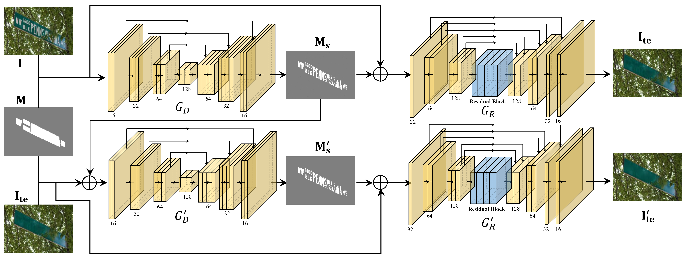

# Scene text removal via cascaded text stroke detection and erasing

The training set of synthetic database consists of a total of 617401 images and the test set contains 2000 images; all the training and test samples are resized to 256 × 256. The code for generating synthetic dataset and more synthetic text images as described in “Ankush Gupta, Andrea Vedaldi, Andrew Zisserman, Synthetic Data for Text localisation in Natural Images, CVPR 2016", and can be found in (https://github.com/ankush-me/SynthText).
Besides, all the real scene text images are also resized to 256 × 256.

For more details, please refer to our [CVM 2021 paper] arXiv: https://arxiv.org/abs/2011.09768


## Requirements
1. Tensorflow==1.13.1
2. Python==3.6.13
3. CUDA==10.0.
4. Opencv==4.5.1.
5. Numpy.

## Installation
  1. Clone this respository.
     ```
     git clone https://github.com/wcq19941215/SceneTextRemoval.git
     ```
## Running
  ### 1. Image Prepare
  You can modify the path of the trainset, valset dir, and other hyperparameters in `config.yml`.
  It should be noted that during training, gt, mask, and image are concat into a single image, which will be automatically separated during training.
  ### 2. Training
  Once `config.yml` is configured, you only need to run train.py. Then run the following code:
  ```
  python train.py
  ```
  ### 3. Testing
  During the test, `test.py` can only get the output result, not including the evaluation result such as `PSNR`. Please run the following code:
  ```
  python test.py \
  --image=[the path of test images] \
  --mask=[the path of test mask] \
  --output=[Where to save output image.] \
  --checkpoint_dir=[The directory of tensorflow checkpoint]
  ```
  For fair comparison, we use the same evaluation method as [Ensnet](https://github.com/HCIILAB/Scene-Text-Removal), you can find the evaluation metrics in this website [PythonCode.zip](http://pione.dinf.usherbrooke.ca/static/code), You can also use `UTILITY.py` to test PSNR and SSIM

## Paper

Please consider to cite our paper when you use our database:
```
@article{Bian2021Scence,
  title     = {Scene text removal via cascaded text stroke detection and erasing},
  author    = {Xuewei Bian, Chaoqun Wang, Weize Quan, Juntao Ye, Xiaopeng Zhang, Dong-Ming Yan}
  joural    = {CVM}
  year      = {2021}
}
```
